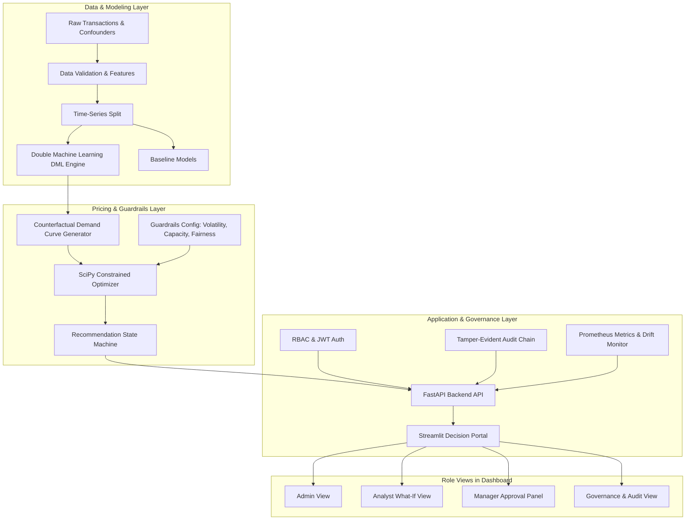

# System Architecture & Technical Design

**Project**: BDS-39 Counterfactual Dynamic Pricing System  
**Level**: High-Level Architecture & Component Interaction

---

## 1. High-Level Architecture Overview

The system follows a modular, layered architecture separating the **Data & Causal ML Engine**, **Constrained Optimizer**, **Backend API (FastAPI)**, and **Frontend Decision Portal (Streamlit)**.

---

## 2. Directory & Component Mapping

| Package | Path | Responsibility |
|---|---|---|
| **Common** | `src/common/` | Configuration loading (YAML + Env), Structured JSON Logging. |
| **Data Layer** | `src/data/` | Synthetic data generator with confounding, Pandera/Pydantic schemas, feature engineering, leakage checks. |
| **Modeling** | `src/models/` | Baseline models (Cost-plus, naive LightGBM), Causal DML elasticity estimators, sensitivity testing. |
| **Pricing Engine**| `src/pricing/` | Demand curves, price grid generator, SciPy SLSQP constrained optimizer, guardrails enforcement. |
| **Backend API** | `src/api/` | REST API endpoints, recommendation lifecycle state machine, error handling. |
| **Auth & RBAC** | `src/auth/` | JWT token generation, bcrypt password hashing, role-based dependency injection. |
| **Audit Log** | `src/audit/` | SHA-256 hash-chained immutable audit log, policy verification. |
| **Monitoring** | `src/monitoring/`| Prometheus `/metrics`, drift detectors (PSI/KS test), model health statistics. |
| **Dashboard** | `dashboard/` | Streamlit role-aware UI pages and what-if simulation panels. |
