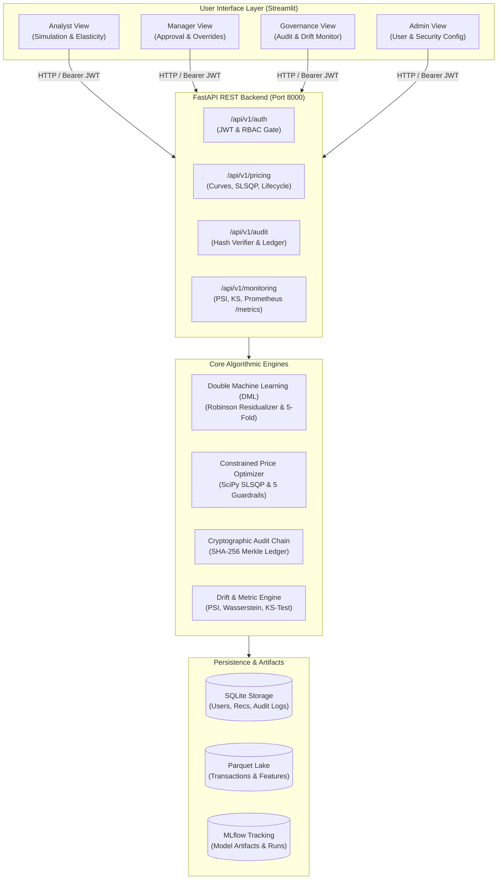
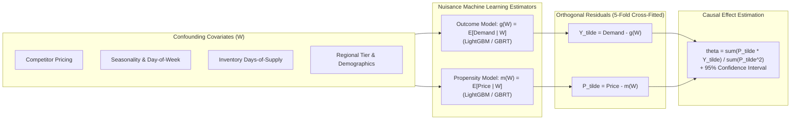
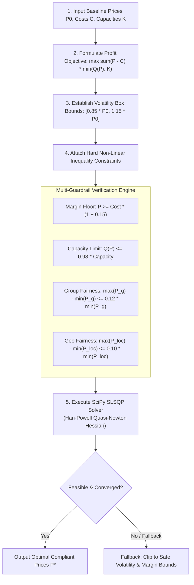
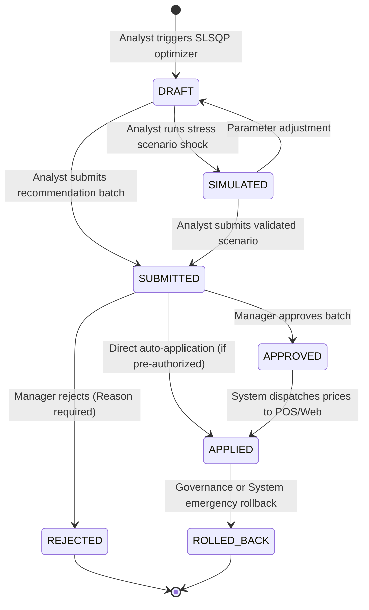
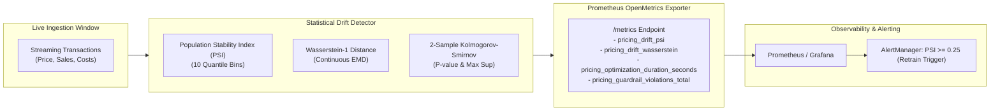

# BDS-39: System Architecture & Dataflow Diagrams

This document collects the complete set of architectural, econometric, mathematical, security, and lifecycle diagrams for **BDS-39: Counterfactual Dynamic Pricing with Revenue, Fairness and Customer-Impact Guardrails**.

---

## 1. High-Level System Architecture

---

## 2. Causal Elasticity Estimation (Double Machine Learning DAG)

---

## 3. Constrained SLSQP Non-Linear Portfolio Optimization Flow

---

## 4. Recommendation Lifecycle State Machine

---

## 5. Cryptographic SHA-256 Hash Chain Structure

```mermaid
flowchart LR
    subgraph Genesis["Genesis Block (ID: 0)"]
        G_Payload["ID: 0\nEvent: GENESIS\nActor: system\nDetails: Chain initialized"]
        G_Prev["Prev Hash: 0000000000000000..."]
        G_Hash["Current Hash: a3f89e21..."]
    end

    subgraph Block1["Audit Block 1 (ID: 1)"]
        B1_Payload["ID: 1\nEvent: OPTIMIZATION_RUN\nActor: analyst_bob\nDetails: Portfolio P01-P12 solved"]
        B1_Prev["Prev Hash: a3f89e21..."]
        B1_Hash["Current Hash: 7c4e11a0..."]
    end

    subgraph Block2["Audit Block 2 (ID: 2)"]
        B2_Payload["ID: 2\nEvent: RECOMMENDATION_APPROVED\nActor: manager_alice\nDetails: Approved Batch #104"]
        B2_Prev["Prev Hash: 7c4e11a0..."]
        B2_Hash["Current Hash: e9b433cf..."]
    end

    Genesis -->|Previous Hash Link| Block1
    Block1 -->|Previous Hash Link| Block2
```

---

## 6. Continuous Drift & Prometheus Metric Pipeline

